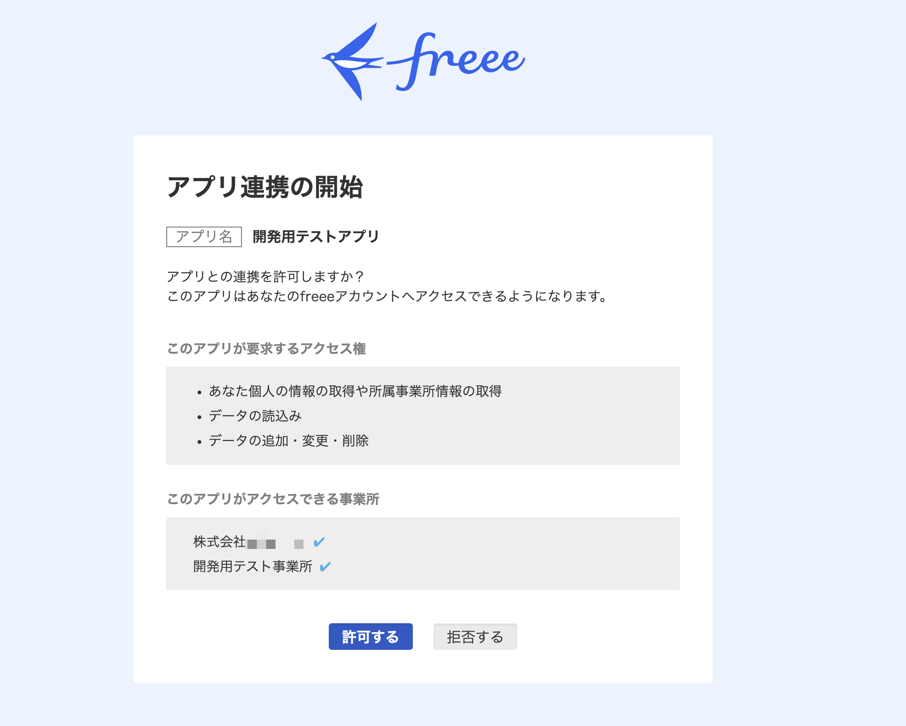

# freee-demo-kit

[](https://www.npmjs.com/package/freee-demo-kit)
[](https://opensource.org/licenses/MIT)
[](https://nodejs.org/)

> Part of the [zeimu-ai](https://github.com/zeimu-ai) organization

freee サンドボックス事業所に、対話式ウィザードでデモデータを一括投入するOSS CLIツール。

---

## はじめかた

### ステップ 1 — Node.js のインストール

[Node.js 公式サイト](https://nodejs.org/ja/) から **v20 以上** をインストールしてください。

```bash
node --version
# v20.x.x 以上が表示されれば OK
```

### ステップ 2 — freee アプリの作成

freee-demo-kit は freee の OAuth アプリ認証情報（Client ID / Client Secret）を使って API にアクセスします。

1. [freee Developers Console](https://app.freee.co.jp/developers) を開き、「新しいアプリを作成」をクリック

2. 以下のように入力して作成：

   | 項目 | 値 |
   |------|---|
   | アプリ名 | （任意）例: `freee-demo-kit` |
   | アプリ種別 | **プライベートアプリ** |
   | コールバック URL | **`http://localhost:8080/callback`** |

   > ⚠️ コールバック URL が違うと認証が失敗します。必ず `http://localhost:8080/callback` を入力してください。

3. 作成後に表示される **Client ID** と **Client Secret** を控えておきます（Client Secret は一度しか表示されません）

### ステップ 3 — インストール & セットアップ

```bash
npm install -g freee-demo-kit
fdk setup
```

`fdk setup` を実行すると、対話式ウィザードが起動します。

```
  freee demo kit  Sandbox セットアップウィザード

◇ はじめよう！3ステップでデモデータを投入します

  ┌─ Step 1/3  認証情報の設定 ─────────────────────┐
  │ freee Developers Console でアプリを作成してください │
  └────────────────────────────────────────────────┘
◆ Client ID を入力してください
◆ Client Secret を入力してください
  ✅ .env を作成しました

  ┌─ Step 2/3  freee 認証 ──────────────────────────┐
  ⠋ ブラウザで認証中...
  ✅ 認証成功: 山田 太郎
  └────────────────────────────────────────────────┘

  ┌─ Step 3/3  プリセット選択 ──────────────────────┐
  ❯ accounting/quickstart  — 架空ITサービス業・3ヶ月分
    accounting/restaurant  — 架空居酒屋・飲食業
    invoices/quickstart    — 請求書・売掛金管理
    ...
  └────────────────────────────────────────────────┘
  ⠋ 取引を投入中 (23/52)...
  ✅ 投入完了！

  🎊 accounting/quickstart のデモデータを投入しました！
     📊 口座   3 件
     💰 取引  52 件
     📝 仕訳   5 件
```

---

## 認証画面について

freee ログイン後、以下のような画面が表示されます：



アカウント内の全事業所が表示されますが、これは freee の仕様です。「許可する」をクリックして問題ありません。
**実際にデータが書き込まれる事業所は `fdk whoami` で確認・切り替えできます。**

---

## 税理士・会計事務所の方へ

顧問先のサンドボックス事業所でデモをする場合、**アプリは顧問先ではなくご自身の事務所アカウントで作成**してください。

> ⚠️ 顧問先事業所（アドバイザーとして招待された事業所）ではアプリを作成できません。

ステップ 2 のアプリ作成を**事務所アカウント**で行った後、`fdk setup` を実行してください。
ログイン後の事業所選択画面で、デモを行いたい**顧問先のサンドボックス事業所**を選択します。

---

## コマンド一覧

| コマンド | 説明 |
|---------|------|
| `fdk setup` | **対話式ウィザード**（初回セットアップはこれ一択） |
| `fdk auth` | freee OAuth ログイン（ブラウザ起動） |
| `fdk auth --status` | 認証状態・トークン有効期限確認 |
| `fdk auth --logout` | トークン削除 |
| `fdk whoami` | 認証済みユーザー・事業所情報表示 |
| `fdk list` | 利用可能なプリセット一覧 |
| `fdk status` | 投入済みプリセット一覧と件数を表示 |
| `fdk load <preset>` | 指定プリセットのデータを投入 |
| `fdk load <preset> --dry-run` | 投入シミュレーション（変更なし） |
| `fdk load <preset> --force` | 投入済みでも上書き投入 |
| `fdk load <preset> --yes` | 確認プロンプトをスキップ（自動化向け） |
| `fdk load-all` | 全プリセット一括投入 |
| `fdk reset` | 全デモデータを削除 |
| `fdk reset <preset>` | 指定プリセットのデータのみ削除 |
| `fdk validate` | 全プリセット JSON のスキーマ・貸借検証 |
| `fdk validate <preset>` | 指定プリセットのみ検証 |
| `fdk validate --accounting` | 会計・税務ルール検証（役員報酬・税区分・交際費） |
| `fdk verify <preset>` | 投入データを freee API で突合確認（CI/CD 対応） |
| `fdk corrupt <preset>` | 指定プリセットに会計エラーを注入した破損版を生成 |
| `fdk corrupt <preset> --rules officer-pay,tax-code` | 注入するエラールールを指定 |
| `fdk corrupt <preset> --output path/to/out.json` | 破損プリセットをファイルに出力 |
| `fdk corrupt <preset> --dry-run` | 注入内容の確認（変更なし） |

---

## プリセット一覧

### 通常プリセット

#### 汎用・スタンダード

| プリセット | 内容 | 口座 | 取引 | 仕訳 |
|-----------|------|:----:|:----:|:----:|
| `accounting/quickstart` | 架空ITサービス業・3ヶ月分（売掛金入金フロー含む） | 3 | 52 | 11 |
| `accounting/full-year` | 架空ITサービス業・12ヶ月分・異常値パターン付き | 3 | 98 | 12 |
| `invoices/quickstart` | 請求書・売掛金管理（入金消込フロー含む） | 2 | 22 | 6 |
| `expenses/quickstart` | 経費精算（交通費・接待費・消耗品費・通信費） | 2 | 24 | 3 |
| `hr/quickstart` | 給与・人事（基本給・残業代・夏季賞与・社会保険・源泉税）6ヶ月分 | 1 | 34 | 20 |
| `unclassified/quickstart` | 銀行明細インポート直後を再現（全費用を「雑費」で仮計上） | 1 | 20 | 0 |
| `common/depreciation` | 固定資産・月次減価償却（PC・サーバー・エアコン） | 1 | 18 | 9 |

#### 業種別

| プリセット | 内容 | 口座 | 取引 | 仕訳 |
|-----------|------|:----:|:----:|:----:|
| `accounting/restaurant` | 架空居酒屋・食材仕入の軽減税率（8%）と酒類（10%）を分岐 | 2 | 35 | 6 |
| `accounting/construction` | 架空外装工事業・完成工事高・外注費3分法 | 2 | 30 | 6 |
| `accounting/sole-proprietor` | 架空フリーランス（個人事業主）・事業主報酬・専従者対応 | 2 | 20 | 6 |
| `accounting/medical` | 架空内科クリニック・保険診療（非課税）と自費診療（課税）の混在 | 2 | 24 | 6 |
| `accounting/real-estate` | 架空不動産賃貸業・居住用（非課税）と事務所（課税）の混在 | 1 | 24 | 6 |
| `accounting/retail` | 架空雑貨小売店・商品仕入・棚卸・月次在庫調整 | 2 | 30 | 6 |
| `accounting/it-startup` | 架空SaaS企業・サブスク収益・ソフトウェア資産計上・前受収益 | 1 | 21 | 9 |
| `accounting/non-profit` | 架空NPO法人・収益事業（課税）と非収益事業（非課税）の区分管理 | 1 | 18 | 6 |
| `accounting/manufacturing` | 架空製造業・材料費・労務費・製造間接費の三分法・仕掛品・製品勘定 | 2 | 30 | 9 |
| `accounting/payroll-agency` | 社労士・給与計算代行事務所・顧問料収入・社会保険料預り金処理 | 2 | 27 | 6 |
| `accounting/npo-subsidy` | 補助金受給NPO法人・交付決定→入金→精算・前受金・会費収入 | 2 | 24 | 6 |
| `accounting/freelance-invoice` | インボイス制度対応フリーランス・登録番号あり/なし混在・源泉徴収 | 2 | 24 | 6 |
| `invoices/subscription` | SaaS月次サブスクリプション・年次一括・前受収益の月次振替 | 2 | 24 | 6 |

#### 高度・複合

| プリセット | 内容 | 口座 | 取引 | 仕訳 |
|-----------|------|:----:|:----:|:----:|
| `advanced/multi-period` | 複数期比較・前期繰越残高・期首仕訳（財務DD・年度比較デモ用） | 3 | 32 | 9 |
| `advanced/multi-company` | グループ会社・親子会社間取引・連結消去仕訳（M&A PMI デモ用） | 4 | 36 | 6 |

### エラーインジェクション・プリセット

意図的に会計・税務上の誤りを含むデータセットです。`fdk validate --accounting` で検出できます。

| プリセット | 混入エラー | 検出ルール |
|-----------|-----------|-----------|
| `errors/officer-pay` | 役員報酬を「給料手当」で誤計上 | OFFICER-PAY-001 |
| `errors/tax-code` | 売上高・外注費・給料手当の税区分誤り | TAX-CODE-001 |
| `errors/entertainment` | 交際費の月次上限（¥667,000）超過 | ENTERTAINMENT-001 |
| `errors/mixed` | 上記3種の複合エラー | 全ルール |
| `errors/consumption-tax` | インボイス未登録業者の控除過大・軽減税率/非課税の誤適用 | TAX-CODE-001 |
| `errors/year-end-closing` | 翌期売上の前倒し計上・前払費用の誤処理・未払費用計上漏れ・仮勘定未振替 | PERIOD-001/002, ACCRUAL-001, SUSPENSE-001 |
| `errors/depreciation-method` | 償却方法誤り（定額↔定率）・耐用年数誤適用・少額減価償却特例の誤適用 | DEPRECIATION-001/002/003 |
| `errors/overdue-receivable` | 長期未回収売掛金・貸倒引当金未計上・法的貸倒の未処理・合意なし相殺 | RECEIVABLE-001/002/003 |
| `errors/duplicate-journal` | 同一取引の二重入力・自動仕訳と手動仕訳の重複・月次締め後の再計上 | DUPLICATE-001/002/003 |

プリセットの仕様・カスタムプリセットの作り方は [`presets/README.md`](presets/README.md) を参照してください。

---

## 会計・税務バリデーション

`fdk validate --accounting` で以下のルールをチェックします。

| ルールID | 内容 | 深刻度 |
|---------|------|:------:|
| `OFFICER-PAY-001` | 役員（取締役・監査役等）の取引に「給料手当」が使われていないか | ERROR |
| `TAX-CODE-001` | 勘定科目ごとの許容税区分と不一致（売上高: 21/13、外注費: 34/18 等） | ERROR |
| `ENTERTAINMENT-001` | 交際費の月合計が ¥667,000 を超過 | WARNING |

```bash
fdk validate --accounting          # 全プリセットを検証
fdk validate errors/mixed --accounting  # 特定プリセットのみ
```

---

## テストカバレッジ

`npm test` で 167 テストが実行されます。

| テストファイル | 対象 |
|---|---|
| `accounting-validator.test.ts` | 役員報酬・税区分・交際費の会計バリデーションルール |
| `confirm-company.test.ts` | 事業所確認プロンプト（`--yes` / y/n 入力） |
| `corrupt-injector.test.ts` | エラー注入ロジック（3ルール・イミュータビリティ） |
| `env-loader.test.ts` | `.env` 読み込み・不存在時の安全性 |
| `env-writer.test.ts` | `.env` 書き込み・パーミッション 600 |
| `freee-api.test.ts` / `freee-api-write.test.ts` | API クライアント（正常系・トークンリフレッシュ） |
| `freee-api-errors.test.ts` | GET/POST/DELETE エラー・トークンリフレッシュ失敗 |
| `no-real-names.test.ts` | 全プリセットへの実在名混入防止（ブロックリスト 25 件） |
| `preset-loader.test.ts` | プリセット読み込み・スキーマ検証 |
| `preset-validator.test.ts` | パストラバーサル防止・文字種バリデーション |
| `run-load.test.ts` | `runLoad` ブランチ（dryRun・force・confirmCompany・onProgress 等） |
| `state-store.test.ts` / `token-store.test.ts` | ファイル永続化・パーミッション・`listAllStates` |
| `status.test.ts` | `fdk status` 出力フォーマット |
| `validate-balance.test.ts` | `validateAccountingBalance` 貸借一致チェック |

> freee API との実際の通信（load / reset / verify）は統合テスト未対応です。動作確認は実際のサンドボックス事業所に対して手動で実施してください。

---

## コントリビューション

コントリビューションを歓迎します。[CONTRIBUTING.md](CONTRIBUTING.md) をお読みください。

```bash
git clone https://github.com/zeimu-ai/open-freee-demo-kit.git
cd open-freee-demo-kit
npm install
npm test
```

---

## よくあるエラーと解決方法

### `fdk auth` / `fdk setup` 後のブラウザに「必須パラメータが不足しているか...」と表示される

**原因：** freee アプリのコールバック URL が正しく設定されていません。

**解決方法：**
1. [freee Developers Console](https://app.secure.freee.co.jp/developers/applications) を開く
2. 該当アプリをクリックして編集画面を開く
3. コールバック URL を `http://localhost:8080/callback` に変更して保存する
4. `fdk setup` または `fdk auth` を再実行する

---

### `fdk load` で「勘定科目が見つかりません」が表示され、取引/仕訳が一部投入されない

**原因：** freee の勘定科目はアカウント種別（法人/個人事業主）やプランによって異なります。業種別プリセット（`accounting/medical` など）が使用する科目が、お使いの事業所に存在しない場合に発生します。

**対処方法：**
- `fdk dry-run <preset>` で投入予定の科目名を事前確認する
- `fdk validate <preset>` でスキーマチェックを実施する
- freee の「勘定科目の設定」から対象科目を追加する

> **個人事業主プリセット（`accounting/sole-proprietor`）について：**
> `事業主貸`・`専従者給与` などの科目は個人事業主専用です。法人アカウントでは `役員報酬`・`給料手当` に置き換えて投入されます。

---

## バージョニング

[Semantic Versioning 2.0.0](https://github.com/zeimu-ai/.github/blob/main/VERSIONING.md) に準拠しています。

## ライセンス

[MIT](LICENSE)
